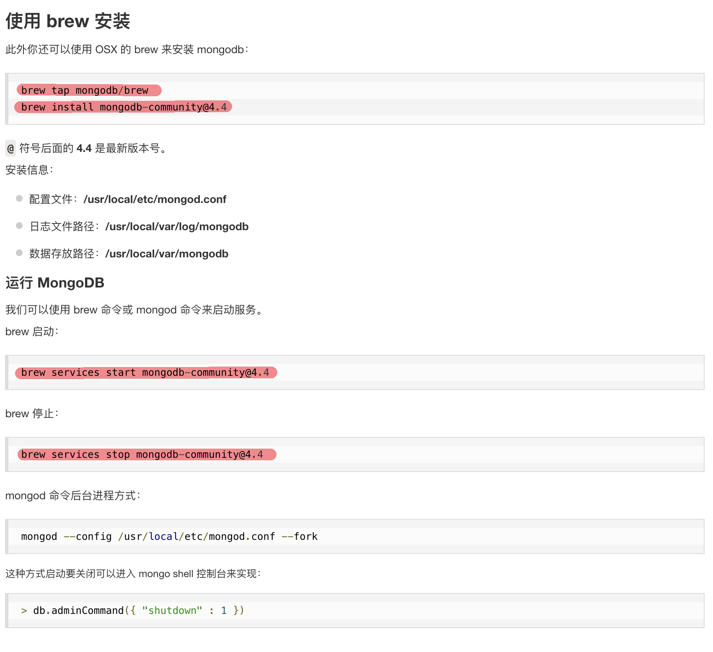

# 项目目录结构

## 中间件的使用
- 通过koa的实例app来使用，app.use(中间件)
- 如果要连续使用多个中间件，则在回调函数中要执行next（）方法
- next方法是异步执行，返回的是promise，因此需要用await来调用
- 所以一般情况下use的回调函数都需要加async

### 路由
- 根据url来进行不同的处理
- 根据method来做出不同的响应 

### 原生路由的实现
- 使用use方法来处理客户端请求
- 接收一个回调函数，并且默认传入context对象
- 通过ctx.url获取到请求的路径
- 通过ctx.body来设置响应数据
- 通过ctx.method来获取请求方法
- 通过ctx.status来设置响应状态码

### 路由中间件koa-router
- 引入中间件 reqiure('koa-router')
- 创建中间件的实例 new koaRouter()
- 可在创建时传入配置，比如设置所有路由的前缀prefix
    - 路由前缀设置必须以/开头，最好以/结尾
- 调用中间件的get方法 router.get(path,callback)
- path:配置路径，callback配置对应的处理方法
- 使用路由中间件，通过koa.use(router.routes())
    - ### 获取请求的参数
    - 通过ctx.request.query，接收get请求的参数
    - ctx.request.params，接收路由参数
    - ctx.request.body，接收post请求的参数。
    - 但是默认body并不是post参数，需要使用中间件koa-bodyparaser来解析

    - ### 发送http响应
    - 通过 ctx.status，设置响应的状态码
    - 通过 ctx.set（“Allow”，"POST","GET",...）设置允许的请求方法
    - 通过 ctx.body来发送响应体

### RESTFul
- 每个资源都被唯一的标识
- 客户端只能通过表述操作服务端数据
- 每个消息必须提供足够的信息让服务端理解
- 点击链接跳转网页

### RESTFul API
- 基本的URL
- 标准的HTTP方法
- 数据传输的类型

### RESTFul API 实践
- 请求规范：url使用复数名词，使用正确的HTTP方法
- 响应规范：查询，分页，字段过滤，状态码，错误处理

### 控制器
- 每个资源的控制器放在不同的文件夹中
- 尽量使用类+类方法的形式编写控制器
- 严谨的错误处理

### 错误处理
- 500 运行时错误
- 412 先决条件失败
- 422 无法处理的实体
- 通过ctx.throw（status,string）来抛出错误，koa自带部分错误处理
- 通过自定义中间件，使用try catch来捕获异常，但是无法捕获到500，以及404
- 通过第三方中间件 koa-json-error 来进行错误处理

### 安全校验
- 使用第三方中间件 koa-parameter 注册未全局对象
- 调用对象的方法verify来进行参数校验

### Nosql
- 非关系型数据库

### MongoDB
- 文档存储
- 

### JWT的使用

- 使用koa-jwt进行路由的，安装koa-jwt，引入到app
- 通过use来使用jwt，在路由之前，配置路由的私钥
- 在登录时，引入jsonwebtoken，使用sign方法来加密生成token
- 自动登录时，引入jsonwebtoken，使用verify方法来解密之前的token
- 在解密时，要先将之前的token获取，并JSON.parse进行转换，否则会出错

### 定义schema时

- 对于数组等复杂类型
- default为undefined，才可以在之后被赋值。
- type为[]

### 实现前端图片存储在本地
- @koa/multer

- koa-router支持在url中通过：指定params参数————》get（“/admin/：id”）

- 聚合操作中$match可以直接指定值进行匹配————》{"$match":{"id":12312}}

### mongodb连接失败
- 使用brew安装的mongodb则必须使用brew的命令来启动
- 启动：brew services start mongodb-community
- 关闭：brew services stop mongodb-community
- 如果不手动关闭

### 使用普通的shell来连接

- mongod 开启服务
- mongo 打开shell连接服务
- </img>
- 

### http请求参数的设置与获取

- 发送get请求
    - params：通过在路径中使用 ‘{}’ 占位
    - query：通过？来隔离，每对 key-value 间通过 & 分割
- 获取get请求
    - params：通过在路径中使用 ‘:key’ 占位，使用ctx.params.key获取
    - query：使用ctx.query.key获取
- delete与get类似

- 发送post请求
    - data：设置header中的data
- 获取post请求
    - data：通过ctx.request.body来获取
- put与post类似

### 模块

- commonjs——》module.exports = {}
    - 导入 const {} = require("./");

- EsModule——》export default {}
    - 导出 import * as A from "./"

### 字段过滤

- 通过$match来设置$ne,$eq,$exist,$nin

### element-ui使用table-tree组件时

- 如果有下级需要展开，不需要设置hasChildren，但是children必须要设置到tree-props对象中
- 同时数据中必须包含children子项
- 如果提示"Error: for nested data item, row-key is required."
- 肯定是row-key设置错误，避免设置为与id相关的字段，有可能会冲突导致错误。

### 使用updateOne或者findOne等mongoose提供的api时，手动匹配ID时，必须将Id转为ObjectId
